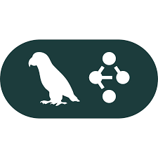

  <h2>🚀 Senior Software Engineer | Cloud-Native | Full Stack | GenAI | Distributed Systems 🚀</h2>

<h4>
Senior Software Engineer with 10+ years of experience building cloud-native, full-stack platforms at IBM and Meta. 
I specialize in designing and shipping API-first, event-driven systems using Python (FastAPI, Django) and Node.js (NestJS), with strong frontend delivery in React, Next.js, and Angular.
</h4>

<h4>
I have extensive experience building secure, scalable backend services and distributed systems on AWS (EKS, ECS, Lambda, RDS, DynamoDB, S3, SQS, SNS), implementing CI/CD automation, observability (OpenTelemetry, Datadog), and production-grade testing strategies.
</h4>

<h4>
I’ve also delivered practical GenAI workflows using LLM orchestration, RAG architectures, embeddings, and vector databases to support incident response and operational tooling — focusing on safety, evaluation, latency, and reliability.
</h4>

<h4>
Known for strong communication, clean architecture principles, and mentoring engineers, I build reliable, production-ready systems that scale and support real business impact.
</h4>
 
 

# 
<table align="center">
<!-- skill -->
  <tr>
    <td align="center" width="90">
      
       Python
    </td>
    <td align="center" width="90">
      
       Javascript
    </td>
    <td align="center" width="90">
      
       Typescript
    </td>
    <td align="center" width="90">
      
       C++
    </td>
    <td align="center" width="90">
      
       GoLang
    </td>
    <td align="center" width="90">
      
       java
    </td>
  </tr>
  <!-- network -->
<tr>
    <td align="center" width="90">
      
       Nodejs
    </td>
    <td align="center" width="90">
      
       Express
    </td>
    <td align="center" width="90">
      
       React
    </td>
    <td align="center" width="90">
      
       Next.js
    </td>
    <td align="center" width="90">
      
       Django
    </td>
    <td align="center" width="90">
      
       FastAPI
    </td>
    
  </tr>
  <tr>
    <td align="center" width="90">
      
       GraphQL
    </td>
    <td align="center" width="90">
      
       Angular
    </td>
    <td align="center" width="90">
      
       PostgreSQL
    </td>
    <td align="center" width="90">
      
       MongoDB
    </td>
    <td align="center" width="90">
      
       MySQL
    </td>
    <td align="center" width="90">
      
       Redis
    </td>
  </tr>
<!-- common -->
  <tr>
    <td align="center" width="90">
      
       OpenAI
    </td>
    <td align="center" width="90">
      
       DeepSeek
    </td>
    <td align="center" width="90">
      
       LangChain
    </td>
    <td align="center" width="90">
      
       LangGraph
    </td>
    <td align="center" width="90">
      
       Hugging Face
    </td>
    <td align="center" width="90">
      
       Ollama
    </td>
  </tr>
  
</table>
 

